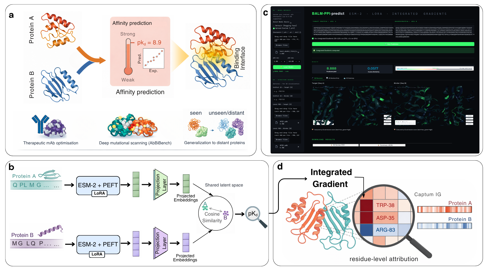

# BALM-PPI: Explainable protein–protein binding affinity prediction via fine-tuning protein language models

A comprehensive framework for protein-protein binding affinity prediction using transformer-based protein language models (PLMs) with advanced training strategies.

Predicting protein–protein binding affinity from sequence alone remains a bottleneck for antibody optimization, biologics design and large-scale affinity modelling. Structure-based methods achieve high accuracy but cannot scale when complex structures are unavailable. Here, we present a framework that reframes affinity prediction as metric learning: two proteins are projected into a shared latent space in which cosine similarity directly correlates with experimental binding affinity, and the protein language model encoder is adapted through parameter-efficient fine-tuning (PEFT). On the PPB-Affinity benchmark, the model achieves Pearson r = 0.89 on a random split, generalises to evolutionarily distant proteins (r = 0.61 at <30% sequence identity) and surpasses structure-based deep learning baselines across biological subgroups, without any three-dimensional input. On the strictly de-overlapped AB-Bind dataset, few-shot adaptation with 30% of assay data (Pearson r = 0.756, RMSE = 0.688) outperforms methods trained on 90% of data; consistent gains are observed across nine diverse AbBiBench deep-mutational-scanning assays with 10–30% labelled variants. Residue-level explainability reveals that the model concentrates importance on interface-localised residues aligned with experimentally validated interaction hotspots across enzyme–inhibitor, and antibody–antigen systems. Together, these results establish a scalable, explainable and data-efficient route to protein-protein binding affinity prediction and therapeutic antibody optimisation from sequence alone.

## Overview

BALM-PPI provides three model architectures for predicting protein-protein binding affinity:




🔗 Paper: https://www.biorxiv.org/content/10.64898/2026.03.30.715237v1

## 🚀 **Quick Start**

To easily test our trained models with custom dataset, we provide a custom, user-friendly notebook for Batch Inference, Zero-Shot, and Few-Shot testing.

Navigate to the BALM-PPI/Notebooks directory.

Open custom_notebook.ipynb.


- 🧬 **Custom dataset usage**: with zero- and few-shot settings: [custom_data_demo.ipynb](BALM-PPI/Notebooks/custom_notebook.ipynb)

### Data Format

Your CSV file should contain the following columns:
- `Target`: Target protein sequence
- `proteina`: Query protein sequence
- `Y`: pKd binding affinity value

Follow the interactive cells to load a pre-trained model (e.g., best_model_fold_1.pth) and pass in your custom protein sequences (CSV file with above format) to evaluate binding affinities without needing to run the full training pipelines.

## Webtool

We have also developed an interactive web application hosted on Hugging Face Spaces (https://huggingface.co/spaces/Harshit494/BALM-PPI), which enables users to access the full prediction and explainability pipeline without requiring any local computational setup.


### Setup

1. Clone the repository:
```bash
cd BALM-PPI
```

2. Create a virtual environment (optional but recommended):
```bash
python -m venv venv
source venv/bin/activate  # On Windows: venv\Scripts\activate
```

3. Install dependencies:
```bash
pip install -r requirements.txt
```

4. Place your dataset in the `data/` directory:
```bash
cp "PPB_Affinity_Sequences.csv" data/
```

## Usage

### Data Format For Full training

Your CSV file should contain the following columns:
- `Target`: Target protein sequence
- `proteina`: Query protein sequence
- `Y`: pKd binding affinity value
- `PDB`: PDB identifier (for cold split)
- `Subgroup`: Data subgroup label
- `Source Data Set`: Source dataset identifier
- `Ligand Name`: Ligand name (for BALM-PPI)
- `Receptor Name`: Receptor name (for BALM-PPI)


### Running Experiments


### Configuration

All experiments are configured via YAML files in the `configs/` directory. 

You can find config files in the configs folder. Below are examples for training different models (Baseline, BALM-PPI without PEFT, and BALM-PPI) on datasets we used in the study.

Edit configuration files to customize experiments without modifying code.

#### 1. Baseline Model

```bash
# Random split
python train_baseline.py --config configs/baseline_config.yaml --split random

# Cold target split
python train_baseline.py --config configs/baseline_config.yaml --split cold_target

# Sequence similarity split
python train_baseline.py --config configs/baseline_config.yaml --split sequence_similarity
```

#### 2. BALM-PPI Without PEFT (Frozen ESM-2)

```bash
# Cold target split (main configuration)
python train_model1.py --config configs/model_1_config.yaml --split cold_target
```

#### 3. BALM-PPI (LoRA Fine-tuning)

```bash
# Cold target split with LoRA
python train_balm_ppi.py --config configs/balm_ppi_config.yaml --split cold_target
```

#### 4. PLMs Ablation Study

```bash
# Test all PLMs with Model-1 architecture
python train_plms.py --config configs/plms_config.yaml --plm esm2
python train_plms.py --config configs/plms_config.yaml --plm ablang2
```

### Data Splitting Strategies

1. **Random Split**: Standard random k-fold splitting
2. **Cold Split**: Group-k-fold based on PDB identifiers (cold start)
3. **Sequence Similarity**: Hierarchical clustering based on k-mer Jaccard similarity

### Reproducibility

All experiments use fixed random seeds and deterministic operations:
```python
from src.utils.reproducibility import setup_reproducibility
setup_reproducibility(seed=42)
```

### Evaluation Metrics

- **RMSE**: Root Mean Square Error
- **Pearson**: Pearson correlation coefficient
- **Spearman**: Spearman rank correlation
- **CI**: Concordance Index (for ranking)


## Results

Results are saved in `results/{model_name}/`:
- `fold_*_predictions.csv`: Per-fold predictions
- `cv_summary_metrics.csv`: Cross-validation summary
- `overall_regression.png`: Regression plot
- `model_metrics.json`: Detailed metrics

## 📝 Citations

If you find the BALM model and benchmark useful in your research, please cite our paper:

```
@article {Singh2026.03.30.715237,
	author = {Singh, Harshit and SINGH, RAJEEV KUMAR and Srivastava, Satya Pratik and Pradhan, Suryavedha and Gorantla, Rohan},
	title = {Explainable protein-protein binding affinity prediction via fine-tuning protein language models},
	year = {2026},
	doi = {10.64898/2026.03.30.715237},
	publisher = {Cold Spring Harbor Laboratory},
	URL = {https://www.biorxiv.org/content/10.64898/2026.03.30.715237v1},
	journal = {bioRxiv}
}

@article{gorantla2025learning,
  title={Learning binding affinities via fine-tuning of protein and ligand language models},
  author={Gorantla, Rohan and Gema, Aryo Pradipta and Yang, Ian Xi and Serrano-Morr{\'a}s, {\'A}lvaro and Suutari, Benjamin and Ju{\'a}rez-Jim{\'e}nez, Jordi and Mey, Antonia SJS},
  journal={Journal of Chemical Information and Modeling},
  volume={65},
  number={22},
  pages={12279--12291},
  year={2025},
  publisher={ACS Publications}
}
```

📫 Contact us

Harshit Singh (hs494@snu.edu.in)

Rohan Gorantla (gorantlarohan@gmail.com)


